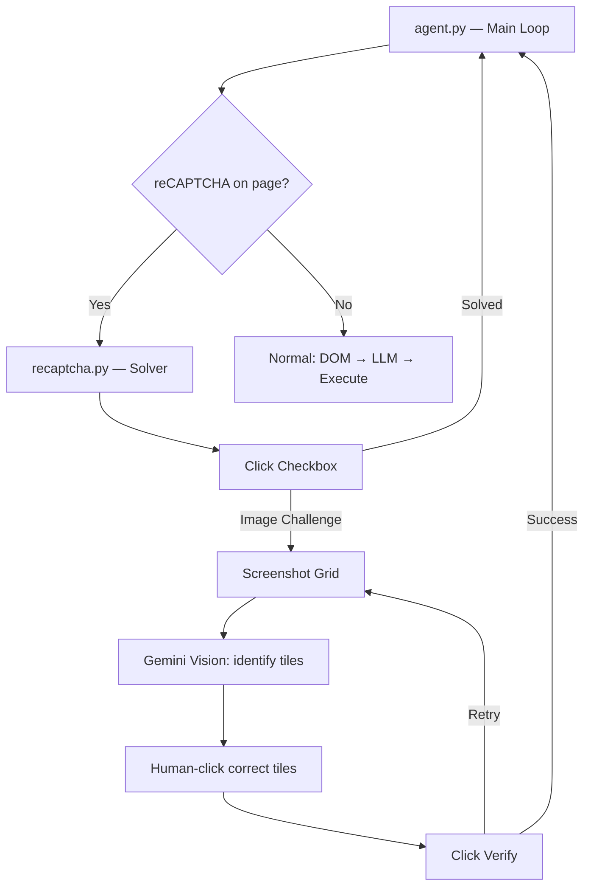

# 🤖 Computer Agent

An AI-powered browser automation agent that can navigate websites, interact with page elements, and **solve reCAPTCHA v2 challenges** using vision AI.

## Architecture



## How It Works

| Module | Role |
|--------|------|
| `browser.py` | Launches a stealth Chromium browser via **patchright** (undetected Playwright fork) |
| `dom.py` | Extracts visible interactive elements + detects reCAPTCHA iframes |
| `llm.py` | **DeepSeek** for text-based action decisions, **Gemini 2.0 Flash** for image analysis |
| `human.py` | Bézier-curved mouse movement, random delays, human-like typing |
| `recaptcha.py` | Full reCAPTCHA v2 solver — checkbox click → image grid challenge → retry loop |
| `executor_browser.py` | Executes click/type actions with human-like behavior |
| `agent.py` | Main loop: detect reCAPTCHA → solve → or normal DOM interaction |

## Setup

```bash
cd python-agent
python -m venv venv
source venv/bin/activate

# Install dependencies
pip install patchright google-generativeai openai python-dotenv mss Pillow
patchright install chromium
```

Create a `.env` file:

```env
DEEPSEEK_API_KEY=your-deepseek-key
GEMINI_API_KEY=your-gemini-key
```

## Usage

```bash
source venv/bin/activate

# Default: run against Google's reCAPTCHA demo page
python agent.py

# Custom URL and goal
python agent.py "https://example.com/login" "Log in to the site"
```

## Tech Stack

- **[Patchright](https://github.com/AbeEstrada/patchright-python)** — Stealth browser automation (Playwright fork)
- **[Gemini 2.0 Flash](https://ai.google.dev/)** — Vision model for image grid challenge solving
- **[DeepSeek](https://www.deepseek.com/)** — Text LLM for page action decisions
- **Python 3.12+**
